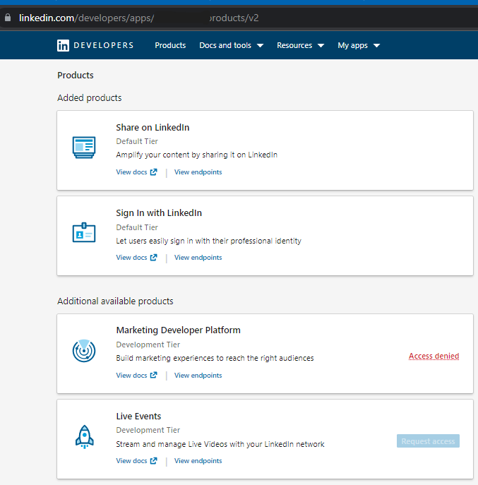
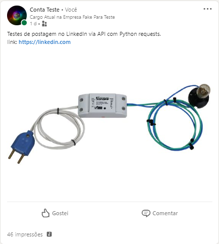
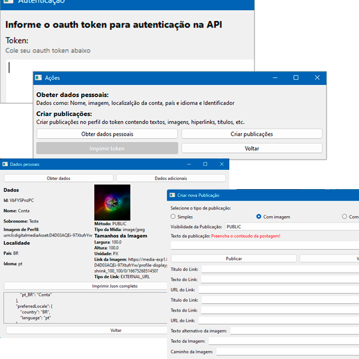

# Consumindo API do LinkedIn com Python

Requisições com a biblioteca _requests_  
Interface utilizando o *PyQt6*

## Referênicas e Pré-requisitos

### LinkedIn

[Documentação da API](https://learn.microsoft.com/pt-br/linkedin/)

Necessário ter uma _company page_ para solicitar uso da API.

### Requests

Requisições: Utilizam a biblioteca _requests_  
[Documentação](https://pypi.org/project/requests/)  
[Utilização - Python’s Requests Library (Guide)](https://realpython.com/python-requests/#the-response)  
[Utilização - GET and POST requests using Python](https://www.geeksforgeeks.org/get-post-requests-using-python/)

Trabalhando com o JSON:  
[Python Create JSON](https://pythonexamples.org/python-create-json/)  
[Working with JSON in Python](https://datagy.io/python-requests-json/)  
[Parse a JSON response using Python requests library](https://pynative.com/parse-json-response-using-python-requests-library/)

### Interface

PyQt6: Biblioteca para construção de interfaces gráficas com Python

`pip install pyqt6`

**Referências:**  
[Creating your first app with PyQt6](https://www.pythonguis.com/tutorials/pyqt6-creating-your-first-window/)  
[Python and PyQt: Building a GUI Desktop Calculator](https://realpython.com/python-pyqt-gui-calculator/)

### Pacotes

| Package            | Version   |
| ------------------ | --------- |
| pip                | 22.3      |
| PyQt6              | 6.4.0     |
| PyQt6-Qt6          | 6.4.0     |
| PyQt6-sip          | 13.4.0    |
| requests           | 2.28.1    |

## Sistema desenvolvido

Para usar o sistema é necessário já ter um token de autenticação para API do LinkedIn.  
Também é necessário instalar as bibliotecas *requests* e *pyqt6*

**Para executar, basta rodar apenas o arquivo *Janelas.py***

As ações disponiveis são as autorizadas pela API do LinkedIn.
<!--  -->

Os escopos são: Obter os dados do usuário autenticado e Criar uma nova publicação de um dos três tipos possiveis (simples, com um link ou com uma imagem)
<!--
**Publicação Simples**  


**Publicação de Imagem**  



**Publicação com Link**  

-->

Prints do Sistema:  


<!-- 
Comando para gerar o executável:  
```
pyinstaller --noconsole Janelas.py --icon='data/linkApi.ico' --add-data 'data/linkApi.ico;data' --add-data 'data/integracaoSft.png;data'
``` -->
